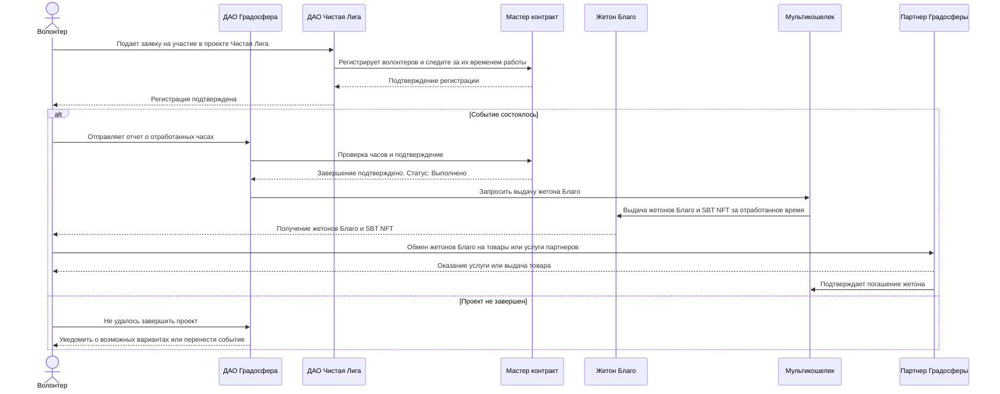
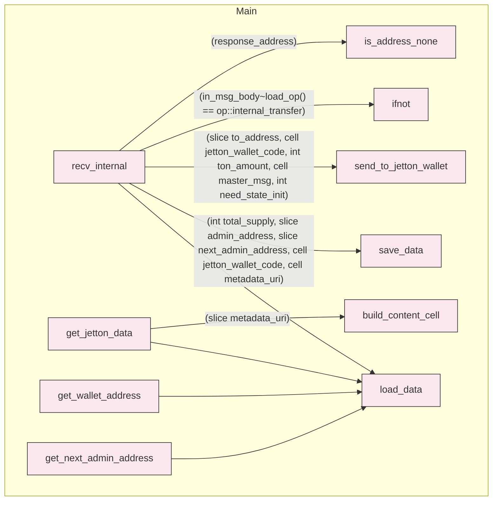

# Жетон Благо

## Архитектура ДАО

Базовая реализация на примере проекта Чистая Лига



## Контракт Благо

|                                                                                                                                |                                                                                                                                         |
| ------------------------------------------------------------------------------------------------------------------------------ | --------------------------------------------------------------------------------------------------------------------------------------- |
| Адрес [jetton_master](https://github.com/ton-blockchain/TEPs/blob/master/text/0074-jettons-standard.md#jetton-master-contract) | [EQBlaryI1HCY6hIlW9giBoqKGtuMHfxlULZOhD6UyzpqLcll](https://tonviewer.com/EQBlaryI1HCY6hIlW9giBoqKGtuMHfxlULZOhD6UyzpqLcll?section=code) |
| Воркчейн                                                                                                                       | Основной воркчейн (0)                                                                                                                   |
| Хэш код                                                                                                                        | xQqQAeboQOjJycSPfJylC4hSbUJEtJgwaTwXLpjgmHE=                                                                                            |
| Кмпилятор                                                                                                                      | func                                                                                                                                    |
| Версия                                                                                                                         | [0.4.4](https://github.com/ton-blockchain/ton/tree/func-0.4.4/crypto/func)                                                              |
| Сборка                                                                                                                         | `func -o output.fif -SPA jetton-minter.fc workchain.fc stdlib.fc op-codes.fc jetton-utils.fc gas.fc`                                    |
| Верифицирован                                                                                                                  | 10/09/2024                                                                                                                              |

## Проверка верификации

Этот исходный код жетона Благо, компилируется в тот же самый байт-код, который находится в сети и проверяется децентрализованной группой валидаторов.

| Состояние   | Публичный ключ                               | IP      | Дата верификации | Верификатор                                                                        |
| ----------- | -------------------------------------------- | ------- | ---------------- | ---------------------------------------------------------------------------------- |
| ✅ Проверен | edaMyPS3LRFd28UVd7qP6YK1Y/JWrW4+hT+ydMO8TRY= | 3.3.3.3 | 10/9/2024        | [Proof](https://verifier.ton.org/EQBlaryI1HCY6hIlW9giBoqKGtuMHfxlULZOhD6UyzpqLcll) |
| ✅ Проверен | 0fjyUVE88fJa2IgWpNjjz6O9TC8ftFoSwb+DI1HvFM8= | 3.3.3.4 | 10/9/2024        | [Proof](https://verifier.ton.org/EQBlaryI1HCY6hIlW9giBoqKGtuMHfxlULZOhD6UyzpqLcll) |
| ✅ Проверен | 1fWcZGowOI0gTHZyTPhTX2s3iBnMSdqsNqJYCWNj0A4= | 3.3.3.5 | 10/9/2024        | [Proof](https://verifier.ton.org/EQBlaryI1HCY6hIlW9giBoqKGtuMHfxlULZOhD6UyzpqLcll) |

## Метаданные

```json
{
  "name": "Blago",
  "description": "Этот проект был создан, чтобы позволить пользователям обменивать и получать активы в экосистеме Градосфера за жетон Благо, который не подвержен волатильным колебаниям. Для соответствия нормативным требованиям эмитент токенов ДАО Градосфера имеет дополнительный контроль с помощью мультиподписного кошелка.",
  "symbol": "BLG",
  "decimals": "0",
  "image": "https://raw.githubusercontent.com/gradosphera/blago-jetton/main/assets/logo.png"
}
```

## Описание

Смарт-контракт жетона Благо на языке FunC с функцией полного управления Децентрализованной Автономной Организацией (ДАО) Градосфера.

## Цели и задачи

Этот проект был создан, чтобы позволить пользователям обменивать и получать активы в экосистеме Градосфера за жетон Благо, который не подвержен волатильным колебаниям. Для соответствия нормативным требованиям эмитент токенов имеет дополнительный контроль с помощью мультиподписного кошелка ДАО Градосфера.

Таким образом, этот жетон Благо представляет собой [стандартный смарт-контракт жетона](https://github.com/ton-blockchain/token-contract/tree/369ae089255edbd807eb499792a0a838c2e1b272/ft) в сети TON с дополнительным функционалом:

- ДАО Градосфера может совершать переводы жетона Благо из кошелька пользователя.
- ДАО Градосфера может сжигать жетоны Благо в кошельке пользователя.
- ДАО Градосфера может заблокировать/разблокировать жетон Благо в кошельке пользователя (`set_status`).
- ДАО Градосфера может сделать перевод и сжечь жетон, даже если кошелек жетона заблокирован.
- ДАО Градосфера может изменить код жетона Благо и его метаданные.

⚠️ Для ДАО критически важно управлять закрытым ключом учетной записи администратора, чтобы избежать любых потенциальных рисков взлома. Для этих целей, используется кошелек с несколькими подписями в качестве учетной записи администратора с закрытыми ключами, хранящимися на разных изолированных кошельках.

⚠️ Контракт не проверяет код и данные в сообщении 'upgrade', поэтому существует вероятность блокировки контракта, если вы отправите недействительные данные или код. Поэтому всегда нужно проверять обновления в тестовой сети.

## Дополнение

- Контракт жетона не включает функционал, позволяющий ДАО выводить TON с баланса кошелька жетона.

- Цена на газ основана на _текущей_ конфигурации блокчейна TON. Стоит иметь в виду ситуацию, когда конфигурация изменилась в тот момент, когда сообщение отправлено с одного кошелька жетона на другой. Снижение комиссий в конфигурации блокчейна не требует дополнительных действий. Однако увеличение комиссий в конфигурации блокчейна требует предварительной подготовки — например, кошельки и приложения должны начать отправлять TON за газ заранее, исходя из будущих параметров.

- Если установлен статус в кошельке жетона, запрещающий прием жетонов Благо - нет гарантии, что при отправке жетонов на такой кошелек, они вернутся обратно и будут зачислены отправителю. В случае нехватки газа они могут быть утеряны. TON за газ и пересылку также не будут возвращены отправителю, а останутся на кошельке жетона.

## Что такое заявка?

Заявка - это последовательный список из одного или нескольких действий, выполняемых с помощью мультикошелька ДАО Градосфера.

## Состояние контракта с заказом

- `multisig_address`- родительский адрес с многопользовательским адресом.
- `order_seqno` - порядковый номер контракта на заявку.
- `threshold`- количество подписей, необходимое для начала выполнения заявки.
- `sent_for_execution?` флаг, указывающий, был ли уже выполнен ордер
- `signers` - словать содержащий адреса подтверждающих контрактов, разрешенные для исполнения заявки.
- `approvals_mask` Битовое поле, где бит "true" в n-й позиции указывает на подтверждение, полученное от n-го подтверждающего.
- `approvals_num` Общее количество подтверждений.
- `expiration_date` Как только текущее время превысит эту отметку, заявка больше не может быть выполнена.
- `order` - ячейка содержащая описание действий.

### Действия по заявке

#### Сообщение

При выполнении заявки, Мультикошелек отправит произвольное сообщение, описываемое действием.

#### Обновление параметров мультикошелька ДАО

При выполнении заявки на обновление мультикошелька, обновляет параметры в соответствии с действием.

Обновляемыми параметрами являются:

- `подтверждающие`
- `порог голосования`

## Жизненный цикл заявки

Жизненный цикл заявки состоит из следующих этапов:

- Инициализация заявки.
- Подтверждение (подпись) заявки.
- Исполнение заявки.

## Гарантии исполнения

- Заявка может быть выполнена только один раз. Если выполнение завершилось некорректно (недостаточно TON для мультикошелька ДАО, список подписывающих изменился, порог голосования стал выше), заявка не может быть повторно использована; Для этого необходимо создать и подтвердить новую заявку.
- Действия с заявками выполняются последовательно одно за другим, что означает, что контракт мультикошелька отправляет сообщения в том же порядке, в котором они указаны (обратите внимание, что если получатели сообщений находятся в разных шардах сети, сообщения будут доставляться асинхронно, возможно, в разном порядке).
- Заявка не может быть выполнена по истечении срока действия.
- После получения одобрения подписавшим его лицом, действие не может быть отозвано.

Обратите внимание, что в приведенных выше гарантиях Порядок означает совокупность всех параметров, в частности идентификатор заявки, список действий с заявкой, даты создания и истечения срока действия, список подтверждающих и т.д.

Можно создать две разных заявки, которые имеют общие параметры (например, список действий), однако такие заявки будут независимыми и для их выполнения потребуются отдельные подтверждения.

Кроме того, после исполнения заявки, контракт такой заявки больше не используется. Учитывая механизм блокчейна TON, это означает, что через некоторое время (обычно через год) этот контракт будет удален из блокчейна. После этого, если мултьтикошелек ДАО Градосфера работает в режиме `allow_arbitrary_order_seqno`, может быть создана новая заявка с тем же order_id. Как и в приведенном выше случае, две заявки с общим идентификатором order_id будут полностью независимыми, могут содержать разный список действий и потребуют отдельных подтверждений (помимо того, что они разделены по времени годом и более).

### Действия с заявкой в Мультикошельке выполняются с учетом баланса мультикошелька

Убедитесь, что у вас достаточно средств на мультикошельке.

## Инициализация заявки

[Инициализация сообщений](https://github.com/ton-blockchain/multisig-contract-v2/blob/master/contracts/multisig.tlb#L74) отправляется из мультикошелька, создавая новый контракт на заявку.  
Только `multisig_address` и `order_seqno` являются частью структуры [initState](https://docs.ton.org/develop/data-formats/msg-tlb#stateinit-tl-b) (определяющей адрес будущего контракта).  
Остальные параметры состояния заявки передаются в теле сообщения.  
Значение параметра `approve_on_init`, равное `true`, указывает на то, что инициализатор хочет подписать заявку во время инициализации.

### Цепочка транзакций

`кошелек -> мультикошелек -> новая заявка`

## Подтверждение заявки

Подтверждение заявки может быть получено либо с помощью сообщения [инициализации](https://github.com/ton-blockchain/multisig-contract-v2/blob/master/contracts/multisig.tlb#L74), либо с помощью сообщения [подтверждения](https://github.com/ton-blockchain/multisig-contract-v2/blob/master/contracts/multisig.tlb#L82).

Поле `signer_index` указывает индекс в словаре `signers`, по которому можно сверять адрес отправителя.

Подтверждение с помощью init будет приниматься только с адреса мультикошелька, где
сообщение об одобрении будет принято, если адрес отправителя совпадает с адресом
в `signers[signer_index]`.

### Цепочка транзакций

`мультикошелек -> заявка`

## Выполнение заявки

Как только количество подтверждений достигает "порогового значения",
[сообщение с функцией выполнить](https://github.com/ton-blockchain/multisig-contract-v2/blob/master/contracts/multisig.tlb#L62) отправляется обратно в мультикошелек вместе со всей суммой на заявку.
Мультикошелек [выполняет проверку](https://github.com/ton-blockchain/multisig-contract-v2/blob/0c7eb74064fea6a77c7a29c0a11d357588b2fceb/contracts/multisig.func#L142) на основе входных данных заявки и принимает их к исполнению, если все условия соблюдены.

### Цепочка транзакций

`заявка -> мультикошелек`

## Требование к балансу заявки

Баланс контракта заявки должен быть достаточным для:

- Хранение до истечения срока заявки `expiration_date`.
- Исполнения мультикошельком до получения стасута заявки [принято](https://github.com/ton-blockchain/multisig-contract-v2/blob/0c7eb74064fea6a77c7a29c0a11d357588b2fceb/contracts/multisig.func#L23) для исполнения.

## Расчет стоимости заявки

Во время инициализации заявки необходимо убедиться, что стоимость сообщения
будет достаточна для покрытия:

- Цепочки транзакций инициализации заявки.
- Хранение заявки.
- Выполнение логики подтверждения в случае, если `approve_on_init` равно `true`.
- Цепочки транзакций для выполнения заявки в случае, если `approve_on_init` равно `true` и `threshold = 1`

### Как происходит расчёт

Стоимость рассчитывается в виде [order_helper.fc#53](https://github.com/ton-blockchain/multisig-contract-v2/blob/0c7eb74064fea6a77c7a29c0a11d357588b2fceb/contracts/order_helpers.func#L53)

В качестве базовых значений используются константы, однако размер ячейки для подтверждающих и размер заявки являются динамическими.
Поэтому к этим базовым значениям добавляются динамически рассчитанные размеры и стоимость потребления газа.

```func
  int initial_gas = gas_consumed();
  (int order_cells, int order_bits, _)     = compute_data_size(order_body, 8192);
	(int signers_cells, int signers_bits, _) = compute_data_size(signers, 512);
	int size_counting_gas = gas_consumed() - initial_gas;
```

Чтобы получить эти константы расхода газа, используются два тестовых примера.

- С небольшим количеством подтверждающих:[tests/FeeComputation.spec.ts#L199](https://github.com/ton-blockchain/multisig-contract-v2/blob/0c7eb74064fea6a77c7a29c0a11d357588b2fceb/tests/FeeComputation.spec.ts#L199), называемых "мало подтверждений"
- С максимальным количеством подтверждающих:[tests/FeeComputation.spec.ts#L205](https://github.com/ton-blockchain/multisig-contract-v2/blob/0c7eb74064fea6a77c7a29c0a11d357588b2fceb/tests/FeeComputation.spec.ts#L205), называемых "много подтверждений"

[contracts/order_helpers.func#L63](https://github.com/ton-blockchain/multisig-contract-v2/blob/0c7eb74064fea6a77c7a29c0a11d357588b2fceb/contracts/order_helpers.func#L63)

#### Плата за отправку

Плата за отправку требуется для покрытия расходов на пересылку сообщений.
Для всех расходов используется тест `мало подтверждений`.

Связанные константы:

`INIT_ORDER_BITS_OVERHEAD` и `INIT_ORDER_CELL_OVERHEAD`
Представляют общее количество битов и ячеек, используемых сообщением инициализации заявки, уменьшенное на количество битов и ячеек, занимаемых содержимым заявки.
[tests/FeeComputation.spec.ts#L123](https://github.com/ton-blockchain/multisig-contract-v2/blob/0c7eb74064fea6a77c7a29c0a11d357588b2fceb/tests/FeeComputation.spec.ts#L123)

```javascript
            /*
              tx0 : external -> treasury
              tx1: treasury -> multisig
              tx2: multisig -> order
            */
  let orderBody = (await order.getOrderData()).order;
  let orderBodyStats = collectCellStats(orderBody!, []);

  let multisigToOrderMessage = res.transactions[2].inMessage!;
  let multisigToOrderMessageStats = computeMessageForwardFees(curMsgPrices, multisigToOrderMessage).stats;
  let initOrderStateOverhead = multisigToOrderMessageStats.sub(orderBodyStats);

```

`EXECUTE_ORDER_BIT_OVERHEAD` и `EXECUTE_ORDER_CELL_OVERHEAD`
следует той же логике, но для выполнения сообщений `заявка -> мультикошелек`.
[tests/FeeComputation.spec.ts#L149](https://github.com/ton-blockchain/multisig-contract-v2/blob/0c7eb74064fea6a77c7a29c0a11d357588b2fceb/tests/FeeComputation.spec.ts#L149)

```javascript
/*
  tx0 : external -> treasury
  tx1: treasury -> order
  tx2: order -> treasury (approve)
  tx3: order -> multisig
  tx4+: multisig -> destination
*/
let orderToMultiownerMessage      = secondApproval.transactions[3].inMessage!;
let orderToMultiownerMessageStats = computeMessageForwardFees(curMsgPrices, orderToMultiownerMessage).stats;
let orderToMultiownerMessageOverhead = orderToMultiownerMessageStats.sub(orderBodyStats);
```

Суммируется с динамическим объемом заявки и количеством подтверждающих для
расчета соответствующих платежей.

```func
    int forward_fees = get_forward_fee(BASECHAIN,
                                       INIT_ORDER_BIT_OVERHEAD + order_bits + signers_bits,
                                       INIT_ORDER_CELL_OVERHEAD + order_cells + signers_cells) +
                       get_forward_fee(BASECHAIN,
                                       EXECUTE_ORDER_BIT_OVERHEAD + order_bits,
                                       EXECUTE_ORDER_CELL_OVERHEAD + order_cells);

```

#### Плата за газ

Затраты на газ привязаны к выполняемым инструкциям TVM, но плата за газ может меняться в зависимости от конфигурации сети. Таким образом, мы полагаемся на расчеты.

[contracts/order_helpers.func#L75](https://github.com/ton-blockchain/multisig-contract-v2/blob/0c7eb74064fea6a77c7a29c0a11d357588b2fceb/contracts/order_helpers.func#L75)

`MULTISIG_INIT_ORDER_GAS` представляет общее количество единиц газа, необходимых для выполнения `op::new_order` на стороне мультикошелька ДАО Градосферы.
Используется тест `много подтверждений`, а затем вычитается значение `size_counting_gas`.
Чтобы получить значение `size_counting_gas`, его нужно выгрузить вручную.

```func
  int size_counting_gas = gas_consumed() - initial_gas;
  size_counting_gas~dump();

```

запишите значение и восстановите исходный файл.

[tests/FeeComputation.spec.ts#L106](https://github.com/ton-blockchain/multisig-contract-v2/blob/0c7eb74064fea6a77c7a29c0a11d357588b2fceb/tests/FeeComputation.spec.ts#L106)

```javascript
/*
              tx0 : external -> treasury
              tx1: treasury -> multisig
              tx2: multisig -> order
            */

let MULTISIG_INIT_ORDER_GAS = computedGeneric(res.transactions[1]).gasUsed;
```

`ORDER_INIT_GAS` - это количество газа используется контрактом заявки при обработке `op::init`. Используется тест `мало подтверждений`, поскольку на него не влияют количество подпсиывающих или размер заявки.

[tests/FeeComputation.spec.ts#L108](https://github.com/ton-blockchain/multisig-contract-v2/blob/0c7eb74064fea6a77c7a29c0a11d357588b2fceb/tests/FeeComputation.spec.ts#L108)

```javascript
let ORDER_INIT_GAS = computedGeneric(res.transactions[2]).gasUsed;
```

`ORDER_EXECUTE_GAS` - это количество газа, потребляемого контрактом заявки после достижения порога голосов. Используется тест `много подтверждений`, поскольку стоимость поиска по словарю зависит от размера словаря.
[contracts/order.func#L109](https://github.com/ton-blockchain/multisig-contract-v2/blob/0c7eb74064fea6a77c7a29c0a11d357588b2fceb/contracts/order.func#L109)

Вычисления:

[tests/FeeComputation.spec.ts#L157](https://github.com/ton-blockchain/multisig-contract-v2/blob/0c7eb74064fea6a77c7a29c0a11d357588b2fceb/tests/FeeComputation.spec.ts#L157)

```javascript
let ORDER_EXECUTE_GAS = computedGeneric(secondApproval.transactions[1]).gasUsed;
```

`MULTISIG_EXECUTE_GAS` - это количество газа, потребляемого мультикошельком до принятия заявки к исполнению.
Для простоты мы используем стоимость выполнения заявки на 1 сообщение.
Используется тест `мало подтверждений`, поскольку на него не влияет количество подтверждающих.

[tests/FeeComputation.spec.ts#L159](https://github.com/ton-blockchain/multisig-contract-v2/blob/0c7eb74064fea6a77c7a29c0a11d357588b2fceb/tests/FeeComputation.spec.ts#L159)

```javascript
let MULTISIG_EXECUTE_GAS = actions.length > 1 ? 7310n : computedGeneric(secondApproval.transactions[3]).gasUsed;
```

В то время как на самом деле это требуется только для учета газа до тех пор, пока [contracts/multisig.func#L23](https://github.com/ton-blockchain/multisig-contract-v2/blob/0c7eb74064fea6a77c7a29c0a11d357588b2fceb/contracts/multisig.func#L23)

Эти константы не будут суммированы с динамическим значением `size_counting`, и плата за газ рассчитывается для каждой из них отдельно.

[contracts/order_helpers.func#L70](https://github.com/ton-blockchain/multisig-contract-v2/blob/0c7eb74064fea6a77c7a29c0a11d357588b2fceb/contracts/order_helpers.func#L70)

```func
    int gas_fees = get_compute_fee(BASECHAIN,MULTISIG_INIT_ORDER_GAS + size_counting_gas) +
    get_compute_fee(BASECHAIN, ORDER_INIT_GAS) +
    get_compute_fee(BASECHAIN, ORDER_EXECUTE_GAS) +
    get_compute_fee(BASECHAIN, MULTISIG_EXECUTE_GAS);
```

#### Плата за хранение

`ORDER_STATE_BIT_OVERHEAD` и `ORDER_STATE_CELL_OVERHEAD` - это количество битов и ячеек, занимаемых состоянием контракта заявки без содержимого заявки. Используется тест `мало подтверждений`, поскольку расходы на `подтверждающих` и `заявки` добавляются динамически

[tests/FeeComputation.spec.ts#L125](https://github.com/ton-blockchain/multisig-contract-v2/blob/0c7eb74064fea6a77c7a29c0a11d357588b2fceb/tests/FeeComputation.spec.ts#L125)

```javascript
let initOrderStateOverhead = multisigToOrderMessageStats.sub(orderBodyStats);
```

[contracts/order_helpers.func#L83](https://github.com/ton-blockchain/multisig-contract-v2/blob/0c7eb74064fea6a77c7a29c0a11d357588b2fceb/contracts/order_helpers.func#L83)

```func
  int storage_fees = get_storage_fee(BASECHAIN, duration,
                                       ORDER_STATE_BIT_OVERHEAD + order_bits + signers_bits,
                                       ORDER_STATE_CELL_OVERHEAD + order_cells  + signers_cells);

```

### Математическая модель токенов "Благо" и "Благодарность" в экосистеме учёта времени

В экосистеме ДАО Градосфера вводятся два взаимосвязанных токена для учёта и мотивации участия:

- **Токен "Благодарность" (BLGT)** — отражает индивидуальное количество времени, вложенного каждым участником в добрые дела и общественные инициативы (учёт вкладов во времени).
- **Токен "Благо" (BLG)** — агрегирует общий вклад сообщества, преобразуя совокупное время и качество внесённого вклада в социальную и экономическую ценность для общества.

#### Обозначения:

- $t_i$ — время вклада участника $i$ (в часах или минутах)
- $w_i$ — вес вклада участника (учитывает качество, значимость, квалификацию)
- $N$ — число участников сообщества
- $B_i^{Благодарность}$ — количество токенов Благодарности, начисленных участнику$ i$
-$B^{Благо}$ — общий объём токенов Благо, отражающий общественный вклад -$c$ — коэффициент коррекции общего вклада (социальное влияние, коэффициент БлагоРодства) -$U$ — число пользователей (людей, потребляющих пользу от вклада) -$r$ — коэффициент БлагоРодства, измеряющий социальный статус и качество вклада

#### 1. Токен "Благодарность" — индивидуальный вклад во времени с корректировкой качества

$$
B_i^{\text{Благодарность}} = t_i \times w_i
$$

- Вклад измеряется в отработанных часах, умноженных на качественный вес.
- $w_i \geq 1$, например $w_i = 1$ для базовой активности, $w_i > 1$ для экспертной, особо значимой деятельности.

#### 2. Токен "Благо" — агрегированный социальный вклад сообщества

Суммируем вклады всех участников с учётом влияния:

$$
B^{\text{Благо}} = c \times \sum_{i=1}^N B_i^{\text{Благодарность}} = c \times \sum_{i=1}^N (t_i \times w_i)
$$

Коэффициент $c$ выражается через:

$$
c = U \times r
$$

где:

- $U$ — число пользователей, которые получают пользу от совокупного вклада (создаёт сетевой эффект).
- $r$ — коэффициент БлагоРодства — отражает качество и социальное значение вклада, может определяться через голосования, экспертную оценку или алгоритмы машинного обучения.

#### 3. Расчёт статуса участника через социальный рейтинг

Для индивидуального статуса с учётом общественной пользы:

$$
S_i = B_i^{\text{Благодарность}} \times U \times r = (t_i \times w_i) \times U \times r
$$

- $S_i$ — социальный статус участника, аналог социального рейтинга, напрямую связан с его вкладом и влиянием.

### Заключение:

- **Токен "Благодарность"** — это цифровое измерение личного временного вклада каждого участника с поправкой на качество.
- **Токен "Благо"** — агрегирует качественный вклад сообщества с учётом числа людей, пользующихся этим Благом, что создает системный социально-экономический эффект.
- Модель способствует стимулированию активного, качественного участия и справедливому учёту вклада в устойчивое общественное благо.

Это обеспечивает прозрачную, честную и мотивирующую структуру вознаграждения в ДАО Градосфера. Математическая модель токенов «Благодарность» и «Благо» в экосистеме учёта времени

В экосистеме ДАО Градосфера введены два взаимосвязанных токена:

- **Токен «Благодарность» ($B_i$)** — отражает индивидуальный временной вклад участника $i$, учитывая качество и значимость его деятельности.
- **Токен «Благо» ($B$)** — агрегирует общий вклад всех участников, учитывая охват и социальный эффект от созданного общественного блага.

#### 1. Вычисление токена «Благодарность» для участника $i$:

$$
B_i = t_i \times w_i
$$

где

$t_i$ — время вклада (часы) участника $i$
$w_i$ — вес (коэффициент качества вклада)

#### 2. Вычисление общего токена «Благо», характеризующего общественное благо:

$$
B = c \times \sum_{i=1}^N B_i = c \times \sum_{i=1}^N (t_i \times w_i)
$$

где
$N$ — число участников сообщества
$c $ — коэффициент социального эффекта, рассчитываемый как:

$$
c = U \times r
$$

— $U$ — количество пользователей, которые пользуются данным благом
— $r$ — коэффициент БлагоРодства, отражающий социальный рейтинг/статус вклада

#### 3. Расчёт социального статуса участника с учётом вклада и влияния:

$$
S_i = B_i \times U \times r = (t_i \times w_i) \times U \times r
$$

где $S_i$ — социальный статус или рейтинг участника $i$.

### Итог

- «Благодарность» — персональный учёт времени и качества вклада.
- «Благо» — агрегированное общественное благо с учётом количества людей и качества вклада.
- Коэффициент БлагоРодства стимулирует ответственное и высококачественное участие, превращая личный вклад в значимый социальный рейтинг.

Эта модель служит основой мотивации и прозрачного расчёта вклада на платформе ДАО Градосфера.

## Установка зависимостей

`npm install`

## Сборка контрактов

`npm run build`

## Запуск тестов

`npm run test`

### Развертывание жетона

`npx blueprint run` or `yarn blueprint run`

использование Toncenter API:

`npx blueprint run --custom https://testnet.toncenter.com/api/v2/ --custom-version v2 --custom-type testnet --custom-key <API_KEY> `

## Примечание

- Контракт жетона Blago устанавливает цену на газ на основе текущей конфигурации блокчейна.

- Важно помнить о ситуации, когда конфигурация изменяется в тот момент, когда сообщение переходит из одного кошелька jetton-wallet в другой. Это может привести к тому, что комиссия за газ будет отличаться от текущей цены. Уменьшение комиссий в конфигурации блокчейна не требует дополнительных действий.

- Однако увеличение комиссий в конфигурации блокчейна требует предварительной подготовки. Например, кошельки и сервисы ДАО Градосфера должны начать отправлять Toncoins за газ заранее, исходя из будущих параметров конфигурации.


